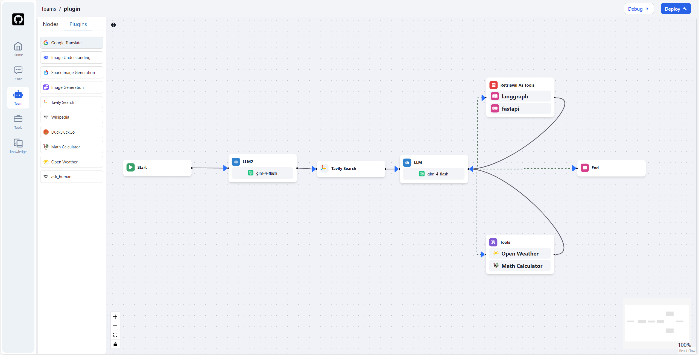

## 📃 Flock

<p align="center">
  <a href="./README_cn.md">简体中文</a> |
  <a href="./README.md">English</a> |
  <a href="./README_ja.md">日本語</a> |
  <a href="#how-to-get-started">Getting Started</a>
</p>

A chatbot, RAG, agent, and multi-agent application project based on LangChain, LangGraph, and other frameworks, open-source, and capable of offline deployment.
<video src="https://private-user-images.githubusercontent.com/49232224/374006908-309ab01e-8a29-4764-b470-dbedea8d8622.mp4?jwt=eyJhbGciOiJIUzI1NiIsInR5cCI6IkpXVCJ9.eyJpc3MiOiJnaXRodWIuY29tIiwiYXVkIjoicmF3LmdpdGh1YnVzZXJjb250ZW50LmNvbSIsImtleSI6ImtleTUiLCJleHAiOjE3MjgyNjg4MzEsIm5iZiI6MTcyODI2ODUzMSwicGF0aCI6Ii80OTIzMjIyNC8zNzQwMDY5MDgtMzA5YWIwMWUtOGEyOS00NzY0LWI0NzAtZGJlZGVhOGQ4NjIyLm1wND9YLUFtei1BbGdvcml0aG09QVdTNC1ITUFDLVNIQTI1NiZYLUFtei1DcmVkZW50aWFsPUFLSUFWQ09EWUxTQTUzUFFLNFpBJTJGMjAyNDEwMDclMkZ1cy1lYXN0LTElMkZzMyUyRmF3czRfcmVxdWVzdCZYLUFtei1EYXRlPTIwMjQxMDA3VDAyMzUzMVomWC1BbXotRXhwaXJlcz0zMDAmWC1BbXotU2lnbmF0dXJlPTJiMGZiZjU3MGIyMWZkZDRkNjI3MmU5MzA1YTZhNmRlODVkZTcxYWI1MjYxMGM2ODU0NzM3OWVkN2MxNTk2MmEmWC1BbXotU2lnbmVkSGVhZGVycz1ob3N0In0.j-kXuux_wfe2bK2VW77TY53mTqj9iYn7kyuxwwwNQQw" data-canonical-src="https://private-user-images.githubusercontent.com/49232224/374006908-309ab01e-8a29-4764-b470-dbedea8d8622.mp4?jwt=eyJhbGciOiJIUzI1NiIsInR5cCI6IkpXVCJ9.eyJpc3MiOiJnaXRodWIuY29tIiwiYXVkIjoicmF3LmdpdGh1YnVzZXJjb250ZW50LmNvbSIsImtleSI6ImtleTUiLCJleHAiOjE3MjgyNjg4MzEsIm5iZiI6MTcyODI2ODUzMSwicGF0aCI6Ii80OTIzMjIyNC8zNzQwMDY5MDgtMzA5YWIwMWUtOGEyOS00NzY0LWI0NzAtZGJlZGVhOGQ4NjIyLm1wND9YLUFtei1BbGdvcml0aG09QVdTNC1ITUFDLVNIQTI1NiZYLUFtei1DcmVkZW50aWFsPUFLSUFWQ09EWUxTQTUzUFFLNFpBJTJGMjAyNDEwMDclMkZ1cy1lYXN0LTElMkZzMyUyRmF3czRfcmVxdWVzdCZYLUFtei1EYXRlPTIwMjQxMDA3VDAyMzUzMVomWC1BbXotRXhwaXJlcz0zMDAmWC1BbXotU2lnbmF0dXJlPTJiMGZiZjU3MGIyMWZkZDRkNjI3MmU5MzA1YTZhNmRlODVkZTcxYWI1MjYxMGM2ODU0NzM3OWVkN2MxNTk2MmEmWC1BbXotU2lnbmVkSGVhZGVycz1ob3N0In0.j-kXuux_wfe2bK2VW77TY53mTqj9iYn7kyuxwwwNQQw" controls="controls" muted="muted" class="d-block rounded-bottom-2 border-top width-fit" style="max-height:640px; min-height: 200px">
</video>

### 🤖️ Overview

### work flow


### AGent Chat


### Image


### Knowledge Retrieval

<p>
  
  
</p>

### Human in the loop (human approval or let the LLM rethink or ask human for help)

Flock aims to be an open-source platform for developing large language model (LLM) applications. It is an LLM-based application utilizing the concepts of
LangChain and LangGraph. The goal is to create a suite of LLMOps solutions that supports chatbots, RAG applications, agents, and multi-agent systems, with the capability for offline operation.

Inspired by the [StreetLamb](https://github.com/StreetLamb) project and its [tribe](https://github.com/StreetLamb/tribe) project , Flock adopts much of the approach and code.
Building on this foundation, it introduces some new features and directions of its own.

Some of the layout in this project references [Lobe-chat](https://github.com/lobehub/lobe-chat), [Dify](https://github.com/langgenius/dify), and [fastgpt](https://github.com/labring/FastGPT).
They are all excellent open-source projects, thanks🙇‍.

### 👨‍💻 Development

Project tech stack: LangChain + LangGraph + React + Next.js + Chakra UI + PostgreSQL

### 💡RoadMap

1 APP

- [x] ChatBot
- [x] SimpleRAG
- [x] Hierarchical Agent
- [x] Sequential Agent
- [ ] Work-Flow ---On Progress
- [ ] More muti-agent

2 Model

- [x] OpenAI
- [x] ZhipuAI
- [x] Siliconflow
- [x] Ollama
- [ ] Qwen
- [ ] Xinference

3 Ohters

- [x] Tools Calling
- [x] I18n
- [ ] Langchain Templates

### 🏘️Highlights

- Persistent conversations: Save and maintain chat histories, allowing you to continue conversations.
- Observability: Monitor and track your agents’ performance and outputs in real-time using LangSmith to ensure they operate efficiently.
- Tool Calling: Enable your agents to utilize external tools and APIs.
- Retrieval Augmented Generation: Enable your agents to reason with your internal knowledge base.
- Human-In-The-Loop: Enable human approval before tool calling.
- Open Source Models: Use open-source LLM models such as llama, Qwen and Glm.
- Multi-Tenancy: Manage and support multiple users and teams.

### How to get started

#### 1. Preparation

##### 1.1 Clone the Code

git clone https://github.com/Onelevenvy/flock.git

##### 1.2 Copy Environment Configuration File

```bash
cp .env.example .env
```

##### 1.3 Generate Secret Keys

Some environment variables in the .env file have a default value of changethis.
You have to change them with a secret key, to generate secret keys you can run the following command:

```bash
python -c "import secrets; print(secrets.token_urlsafe(32))"
```

Copy the content and use that as password / secret key. And run that again to generate another secure key.

##### 1.3 Insatll postgres，qdrant,redis

```bash
cd nextagi
docker compose up -d
```

#### 2.Run Backend

##### 2.1 Installation of the basic environment

Server startup requires Python 3.10.x. It is recommended to use pyenv for quick installation of the Python environment.

To install additional Python versions, use pyenv install.

```bash
pyenv install 3.10
```

To switch to the "3.10" Python environment, use the following command:

```bash
pyenv global 3.10
```

Follow these steps :
Navigate to the "backen" directory:

```bash
cd backend
```

activate the environment.

```bash
poetry env use 3.10
poetry install
```

##### 2.2 initiral data

```bash
# Let the DB start
python /app/app/backend_pre_start.py

# Run migrations
alembic upgrade head

# Create initial data in DB
python /app/app/initial_data.py
```

##### 2.3 run unicorn

```bash
 uvicorn app.main:app --reload --log-level debug
```

##### 2.4 run celery (Not necessary, unless you want to use the rag function)

```bash
poetry run celery -A app.core.celery_app.celery_app worker --loglevel=debug
```

#### 3.Run Frontend

##### 3.1 Enter the web directory and install the dependencies

```bash
cd web
pnpm install
```

##### 3.2 Start the web service

```bash
cd web
pnpm dev

# or pnpm build then pnpm start
```

